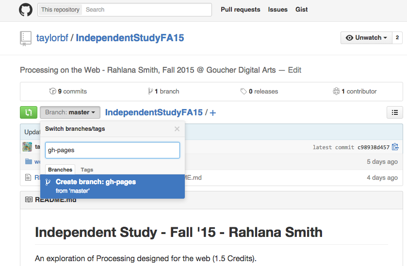
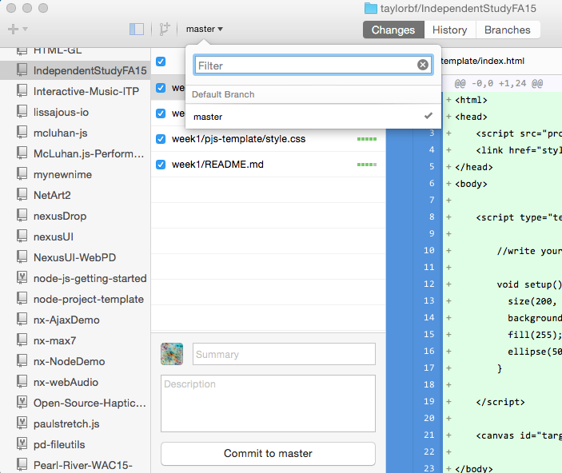

# Week 1

Rahlana: Choose book, brainstorm ideas

Ben: Share template, share tutorial on Github Pages.

## Processing.js Template

In the /pjs-template folder, you can find a template for embedding Processing code within a website, using Processing.js. In the folder, you will find:

#### index.html

This is the main webpage. You can write Processing code between ``, just as I have.

#### processing.js

You don't need to touch this! This is the external library that translates your Processing code to be understood by the browser.

#### style.css

This is the CSS stylesheet which you can use to control the style of your webpage (background-color, font-size, sizes, etc). I added a little bit of code to make the canvas centered on the page, but you can change this to make the page look however you like! **Note: Your canvas is still sized with the size() command from within your Processing code, just like in Processing.** 

## Sharing your work on the web

#### Option 1: madarts.goucher.edu

If you like FileZilla, you can just upload your web projects to your madarts.goucher.edu space, as we did in Media on the Internet and Web Development

#### Option 2: Github Pages

A more conventient alternative might be to use Github Pages, a built-in website hosting service in Github. This way, when you commit your progress to GitHub, it automatically shows up on the web.

To set up Github pages:

On the Github website for our independent study, click on the `branches` menu and create a new branch called `gh-pages`:

.

.

Then, in the GitHub App, on your desktop, you will want to change to your `gh-pages` branch so you can commit code to it. 

Click on the button on the menu bar that says `master`. If you have created a `gh-pages` branch, it should show up in this list of branches.

.

.

.

When you commit code to the `gh-pages` branch, it will show up at:

**yourname**.github.io/**projectname**/

So, for example, my Processing JS template will be here:

[taylorbf.github.io/IndependentStudyFA15/week1/pjs-template/](http://taylorbf.github.io/IndependentStudyFA15/week1/pjs-template/)

This is totally long and verbose. But if you create your own repository for a project, the URL might be something nice and short like:

[LanaSM.github.io/diamonds/](http://LanaSM.github.io/diamonds/)

You are welcome to use the `gh-pages` branch as much as you like. It may be a little confusing at first, but it becomes very convenient and easy once you get used to it! (Sounds like all of programming, huh?)
